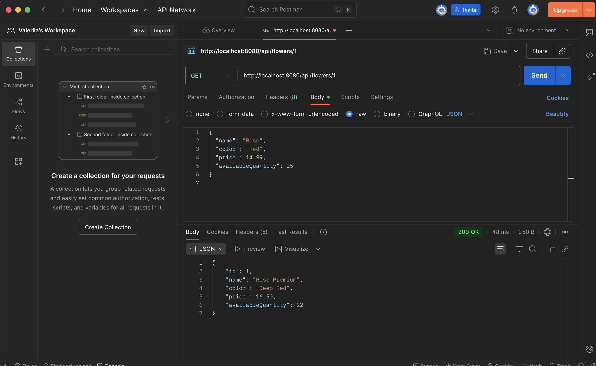
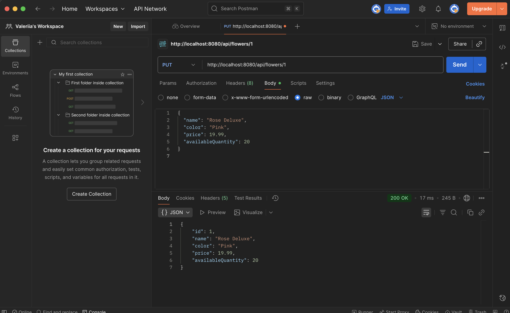
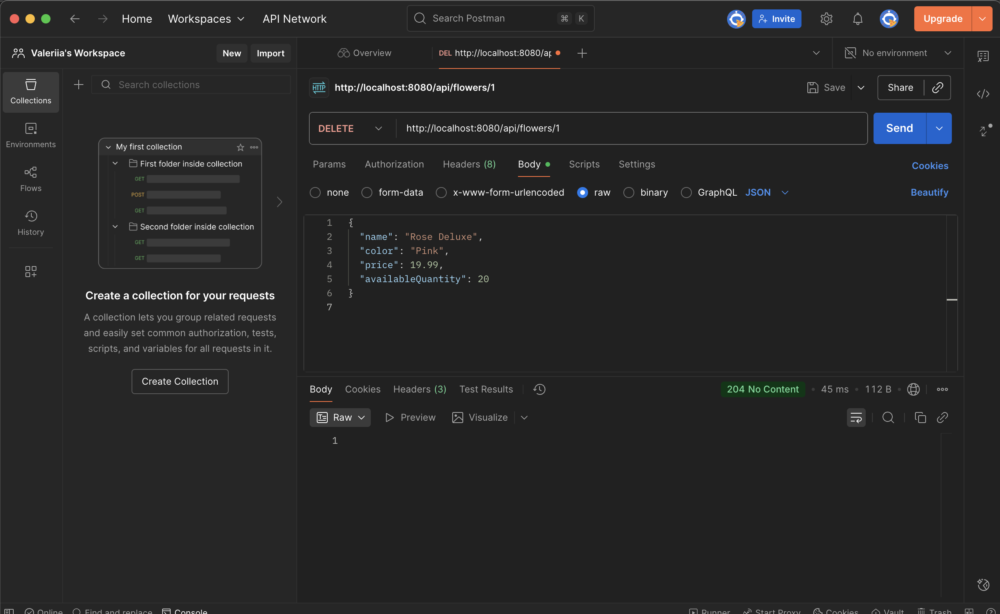

# qap2_flowers
Flowers CRUD API (Spring Boot + MySQL)
Done by Valeriia Holotiuk

It is a basic Spring Boot REST API connected to a MySQL database. The application supports full CRUD (Create, Read, Update, Delete) operations for Flowers.

Overview
The objective of this project was to:
-Build a new Spring Boot application from scratch
-Configure a MySQL database connection
-Implement RESTful API endpoints using Spring Data JPA
-Test each operation using Postman

Technologies Used
Java 
-spring Boot 3.5.6
-Spring Data JPA
-MySQL
-Maven
-Postman for API testing
-API Endpoints

Method	Endpoint	Description
POST	/api/flowers	Create a new flower record
GET	/api/flowers	Retrieve all flowers
GET	/api/flowers/{id}	Retrieve a flower by ID
PUT	/api/flowers/{id}	Update a flower record
DELETE	/api/flowers/{id}	Delete a flower record

Example Requests (Postman)
POST (Create Flower)
POST http://localhost:8080/api/flowers
Content-Type: application/json

{
  "name": "Rose",
  "color": "Red",
  "price": 14.99,
  "availableQuantity": 25
}
PUT (Update Flower)
PUT http://localhost:8080/api/flowers/1
Content-Type: application/json

{
  "name": "Rose Deluxe",
  "color": "Pink",
  "price": 19.99,
  "availableQuantity": 20
}

Database Configuration
File: 
src/main/resources/application.properties
spring.datasource.url=jdbc:mysql://localhost:3307/qap2db
spring.datasource.username=root
spring.datasource.password=Flower123!
spring.jpa.hibernate.ddl-auto=update
spring.jpa.show-sql=true
spring.jpa.properties.hibernate.dialect=org.hibernate.dialect.MySQLDialect
server.port=8080

Project Structure
flowers/
 ┣ src/
 ┃ ┣ main/
 ┃ ┃ ┣ java/com/example/flowers/
 ┃ ┃ ┃ ┣ controller/FlowerController.java
 ┃ ┃ ┃ ┣ service/FlowerService.java
 ┃ ┃ ┃ ┣ repository/FlowerRepository.java
 ┃ ┃ ┃ ┗ model/Flower.java
 ┃ ┃ ┗ resources/application.properties
 ┣ pom.xml
 ┗ README.md

Testing
The API was tested using Postman for all CRUD operations.
Responses were verified to confirm that data is correctly stored, updated, and deleted in the MySQL database.

 Postman Testing Screenshots

*Create (POST)

*Get All (GET)

*Update (PUT)

*Delete (DELETE)

